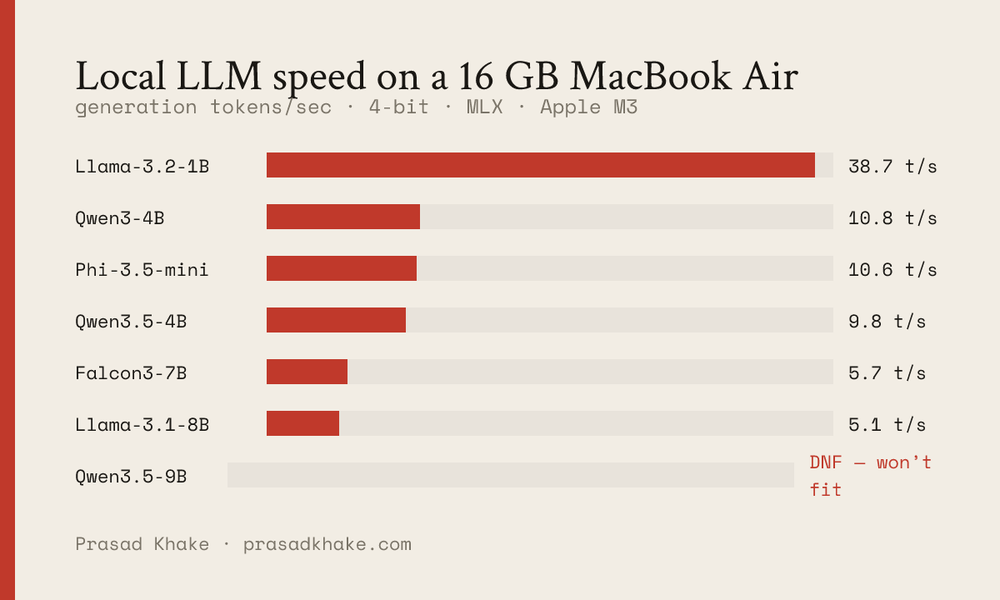

# on-device LLM benchmark — Apple Silicon

Honest numbers for running LLMs **locally on a Mac**, measured on the machine itself.
Most published benchmarks run on datacenter GPUs; this one targets the laptop in front of you.



Full write-up: **[What actually runs well on a 16 GB MacBook](https://prasadkhake.com/blog/16gb-mac-llm)**.

Measured per model (MLX, 4-bit unless noted):

| Metric | What it means |
|---|---|
| **Load (s)** | time to load weights into memory |
| **Prompt t/s** | prefill speed — processing your input ("first token is slow") |
| **Gen t/s** | decode speed — how fast it writes the answer |
| **Peak RAM (GB)** | high-water memory — what actually fits in 16 GB |

## Run

```bash
python3 -m venv .venv && source .venv/bin/activate
pip install -r requirements.txt
python bench.py                      # default 6-model set
# or pick your own:
python bench.py --models mlx-community/Qwen3-4B-4bit mlx-community/Qwen3-8B-4bit
python bench.py --max-tokens 256
python bench.py --card                # render a shareable scorecard PNG → results/card.png
```

First run downloads each model (cached afterward in `~/.cache/huggingface`). Results stream to
`results/results.json` and a Markdown table prints at the end.

## Quality suite (`quality.py`)

Speed isn't the only axis. `quality.py` is a **21-task verifiable** benchmark — 8 coding, 8 math,
5 factual — with no rubric scoring: code is executed and its output checked, math answers are
compared to known results within tolerance, factual answers are checked for key terms. Every task
has a deterministic correct answer.

```bash
python quality.py --model mlx-community/Qwen3-4B-4bit
python quality.py --model mlx-community/Qwen3-4B-4bit --no-think   # Qwen3: enable_thinking=False
python quality.py --model mlx-community/gemma-4-12B-it-4bit --max-tokens 2048
```

`--no-think` disables a reasoning model's thinking trace (for Qwen3, sets `enable_thinking=False`).
On a tight on-device token budget the trace often overruns before the answer lands — see
[this writeup](https://prasadkhake.com/blog/qwen3-4b-thinking-flag-16gb-mac).

### Methodology notes (read before trusting a number)

This harness has had bugs that inflated scores; the fixes are in the code and worth knowing about,
because they generalize ([full writeup](https://prasadkhake.com/blog/benchmark-bugs-that-inflated-my-scores)):

- **Answer extraction reads the *last* number, not the first.** "7! = 5040" must score on 5040, not 7.
- **Peak RAM is reset per model** (`mx.reset_peak_memory()`), so a batch doesn't report the largest
  model's peak for every row.
- **Execute-the-block scoring can't fairly score thinking-style code output.** Models like Gemma 4
  emit correct code across exploratory prose with the call described rather than in the block —
  report their coding as N/A, not a fake number. See the `_extract_code` docstring.

Rule of thumb: **spot-check the failures, not the passes** — a false fail and a real fail look
identical in the table.

## Hardware

Record yours here so the numbers mean something:

- **Machine:** MacBook Air 15-inch (M3, 8-core), 16 GB unified memory, macOS 26.5
- **mlx-lm:** (printed by `pip show mlx-lm`)

## Roadmap (next data points)

- **4-bit vs 8-bit** for one model — the speed/memory/quality tradeoff.
- **Max context before OOM** — push prompt length until it fails; record the ceiling per model.
- **Quantization deep-dive** — group size, what degrades first.
- **Per-model peak RAM in the quality suite** — wire clean per-model memory into `quality.py` output.

## Why this exists

Part of an "On Device" series — getting LLMs to run well on real, consumer hardware.
Writeups: [prasadkhake.com](https://prasadkhake.com).
